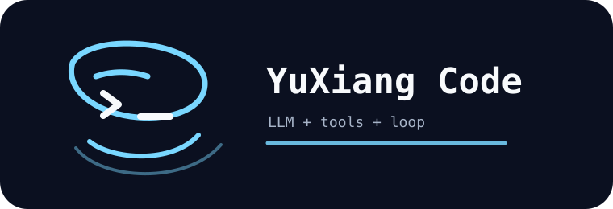

<p align="center">
  
</p>

<h1 align="center">YuXiang Code</h1>

<p align="center">
  <strong>An autonomous agent is just an LLM + tools + a loop.</strong>
</p>

<p align="center">
  <a href="README.zh-CN.md">中文</a>
</p>

<p align="center">
  
  
  
  
  
</p>

<p align="center">
  A tiny, inspectable code agent for people who prefer plain files, visible tool calls, and boring loops that actually work.
</p>

---

## Philosophy

YuXiang Code is intentionally small. It does not try to become an operating system for agents. It keeps the core loop visible:

```text
user -> LLM -> tool call -> tool result -> LLM -> done
```

The point is not to hide complexity behind another framework. The point is to make the agent understandable enough that you can debug it while it is running.

Some things are deliberately missing:

| Deliberately absent | Why |
|---|---|
| Plan Mode | Use a plain `PLAN.md` file instead. It is visible, versionable, and shareable across conversations. |
| MCP integration | Tool descriptions can consume real context budget. CLI tools plus README files are loaded through `bash` only when needed. |
| Sub-agents | A hidden agent inside another hidden agent reduces observability. Use `bash` to call another process when you need one. |
| `maxSteps` ceremony | The loop should end naturally when the task is done. Add step limits only when a real problem appears. |
| Permission theater | Once an agent can write and run code, fake safety prompts are not a security model. Keep the surface local and inspectable. |

## What It Is

- Streaming terminal chat with visible tool calls.
- Local tools for `bash`, `read`, `write`, and `edit`.
- Manual context controls so you can inspect, trim, save, and rewrite the exact model context.
- A local-first CLI, not a hosted agent platform.

That is the product. Everything else has to earn its place.

## Quick Start

```powershell
$env:DEEPSEEK_API_KEY="your-key"
python -m pip install -e .
python .\code_agent.py
```

## Commands

Only slash-prefixed commands are interpreted as commands. `history` is normal chat text; `/history` opens the active context panel.

```text
/help              show commands
/models            show built-in DeepSeek model names
/history           show the full active model context
/context           alias of /history
/clear             clear context and prompt history
/keep [n]          keep only last n context messages
/drop INDEX        remove one context message
/set INDEX text    replace one context message
/system text       replace the system prompt
/save              save context to .agent_context.json
/load              load context from .agent_context.json
/model [name]      show or change model
/exit              quit
```

## Project Layout

```text
.
|-- code_agent.py
|-- pyproject.toml
|-- assets/
`-- src/
    `-- mini_code_agent/
        |-- api.py
        |-- app.py
        |-- config.py
        |-- models.py
        |-- prompt.py
        |-- session.py
        |-- tools.py
        `-- ui.py
```

## License

MIT
